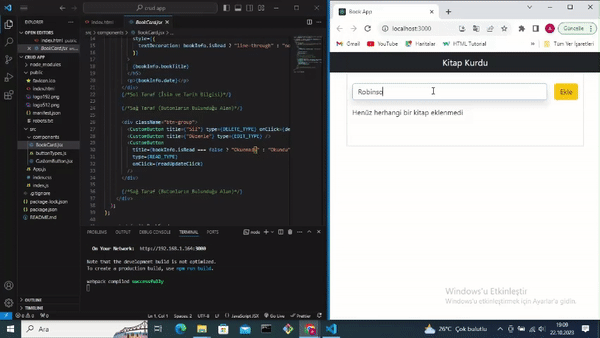

# BookWorm

<h1>BookWorm</h1>

Kendi  ozel kurdugum tanitim amaçli bir yazilimdır

Create (Ekleme) Read (Okuma) Update(Güncelleme) Delete (Sil) 

<ul>

<li>Projeye Stillendirme Boostrap Dahil edildi </li>
<li> 1-Yeni Eklenecek elemanı Almak İçin Bir Form Yapısı Oluştur (Tamamlandı)</li>
<li> 2-Input içerisine girilen veriyi oku (Tamamlandı)</li>
<li> 3-İçeriğinde id, tarih ,okundu bilgisi ve inputtan gelen ismi tutan bir obje oluştur (Tamamlandı)</li>
<li> 4-ekle butonuna basıldığında oluştrualn objeyi bir diziye aktar ve inputu temizle(Tamamlandı)</li>
<li> 5-bookList stateinde tuutlan kitapları map metodu ekran bir card ile göster(Tamamlandı)</li>

<li>6-BookCard daki sil butonuna tıklanıldığında kitabın silinmesi işlemi </li>
 </ul>

<h2>Ekran goruntusu</h2>

